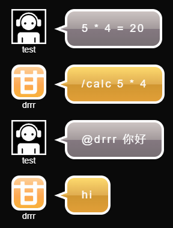
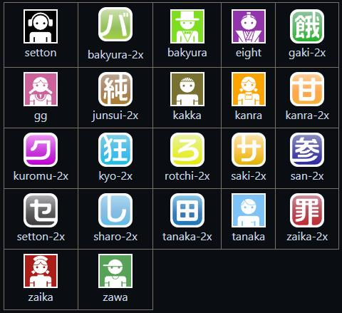

# DrrrBot

简体中文

一个用于 drrr.com 的Python版Bot

该项目是基于 [Transfusion/durararobot](https://github.com/Transfusion/durararobot) 进行修改的。

所做的修改：
* 删除了后台交互终端。
* 添加了房间消息的本地日志（保存在`logs`文件夹中）。
* 添加了自动保持连接的功能（定时向Bot自己发送私信）。
* 更改配置文件为`config.txt`。
* 简化模块的编写方式。
* 添加了一些异常处理和自动处理功能。


## 快速开始

```
# 安装依赖
pip install -r requirements.txt

# 启动Bot
python -u main.py
```


## 配置

你可以通过编辑`config.txt`文件来配置机器人。

```
# 用户名
name = test

# Tripcode
tc = mytc123

# 头像名称
avatar = setton

# 房间ID
roomID = gV8M14bkrv

# 用户代理
agent = Bot

# 加载的模块
mods = Test, BingTa

# 发送消息的等待时间（秒）
throttle = 1.5
```

* 如果你想将某项配置保持默认，可以删除那一行。
* Tripcode（`tc`）可选。如果想无tc登录，只需删除该行或设置为`None`。
* `RoomID`可以在房间的URL中找到，例如：https://drrr.com/room/gV8M14bkrv 。
* 推荐将`throttle`设置为至少`1秒`，如果发送消息太快，你的IP可能会被封禁。
* Cookies将以Bot的用户名为文件名保存在`cookies`文件夹中。如果想重置Cookies，只需删除该文件夹下对应的文件。
* 头像参考[这里](#avatar)。


## 模块示例

```python
// modules/Test.py

from modules.module import Module

class Test(Module):
    def __init__(self, bot):
        super().__init__(bot)

    @property
    def cmds(self):
        # 指令字典，格式为：{函数名: 指令正则表达式}
        cmd_dict = {
                    'sayHello': r'hi',
                    'calculate': r'^\/calc\s+\d+\s+[\+\-\*\/]\s+\d+\s*$'
                    }
        return cmd_dict
    
    def sayHello(self, msg):
        self.bot.send(f'@{msg.user.name} 你好')
    
    def calculate(self, msg):
        cont = msg.message.split(' ', 1)[1]
        result = eval(cont)
        self.bot.send(cont + ' = ' + str(result))
        
```


这段代码实现了两个功能：打招呼（sayHello）和计算功能（calculate）。  
`cmd_dict`字典是指令字典，键为函数名，值为指令的正则表达式。  
当有消息发送到聊天室时，Bot会遍历`cmd_dict`字典，如果消息的内容匹配某个正则表达式，就会调用对应的函数进行响应。  
如果你想添加更多的功能，只需在`cmd_dict`字典中添加对应的函数名和指令正则表达式，并在类中实现响应函数即可。  
具体的正则表达式语法请参考[这里](https://docs.python.org/zh-cn/3/library/re.html)，其他API见下方（更多的信息在源代码中）。  


## API

```
msg.message: 消息的文本内容
msg.user: 发送消息的用户
    msg.user.name: 用户名
    msg.user.id: 用户ID (用于发送私信)
    msg.user.tc: 用户Tripcode
msg.type: 消息类型 (message, me, dm, ...)

self.bot: Bot对象
    self.bot.send(text): 发送消息
    self.bot.dm(userId, text): 发送私信
```


## 用户代理

```
Desktop（桌面）
Mobile（手机）
Bot（机器人）
Tv（电视）
Tablet（平板）
```


## 头像<a name="avatar"></a>

