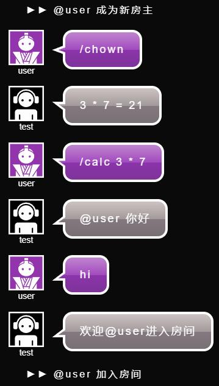
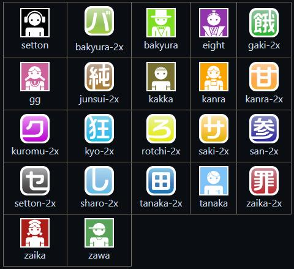

# Drrr-Bot

一个用于 [drrr.com](https://drrr.com) 的 Python 版 Bot，基于 **Socket.IO（WebSocket）** 实时通信。

本项目是基于 [Transfusion/durararobot](https://github.com/Transfusion/durararobot) 进行修改的。

所做的修改：
* 删除了后台交互终端。
* 添加了房间消息的本地日志（保存在`logs`文件夹中）。
* 更改配置文件为`config.txt`。
* 简化模块的编写方式（装饰器声明式写法）。
* 添加了一些异常处理和自动处理功能。
* **连接层重构为 Socket.IO（WebSocket）**：替换旧版不稳定的 `json.php` HTTP 长轮询，根治 520 错误与消息延迟。
* **手动实现轻量 Socket.IO 客户端**：基于 curl_cffi WebSocket（`impersonate='chrome'` 过 Cloudflare），避免 python-socketio 标准 TLS 栈被拦截的问题。
* **类型化数据模型**：消息/用户/房间全部用 dataclass + enum 封装，解析器统一转换。

## 快速开始

```
# 安装依赖（Python 3.13）
pip install -r requirements.txt

# 启动Bot
python -u main.py
```

## 配置

你可以通过编辑`config.txt`文件来配置机器人。

```
# 用户名
name = test

# Tripcode（可选，留空则不使用）
tc = mytc123

# 头像名称
avatar = setton

# 房间ID
roomID = 6JjYq34S35

# 用户代理
agent = Bot

# 加载的模块（使用模块文件名，不含 .py 后缀）
mods = test, guess_number

# 发送消息的等待时间（秒）
throttle = 1.5

# 全局限速：所有网络请求之间的最小间隔（秒），防止被网站封禁 IP
qps = 0.5

# 管理员 Tripcode 列表（逗号分隔，房间管理模块校验用）
admin_tc =
```

* 如果你想将某项配置保持默认，可以删除那一行。
* Tripcode（`tc`）可选。如果想无 tc 登录，只需删除该行或留空。
* `roomID`可以在房间的URL中找到，例如：https://drrr.com/room/6JjYq34S35 中`6JjYq34S35`就是房间ID。
* 推荐将`throttle`设置为至少`1秒`，如果发送消息太快，你的IP可能会被封禁。
* 程序对所有网络请求做了**全局限速（默认每 0.5 秒一次）**，可在 `config.txt` 中通过 `qps` 配置项调整，防止 IP 被封禁。`qps` 为相邻两次网络请求的最小间隔秒数，设置为 `0` 可关闭限速。
* drrr.com 登录时要求通过 **PoW（工作量证明）挑战**，程序已自动处理，无需额外配置。
* Cookies将以Bot的用户名为文件名保存在`cookies`文件夹中。如果想重置Cookies，只需删除该文件夹下对应的文件。
* 模块的文件名使用**小写下划线**命名（如`qing_shu.py`），类名由文件名自动推导（`qing_shu` → `QingShu`）。在配置文件的`mods`项加入模块文件名即可启用，以英文逗号分隔。
* 更多模块可以参考[drrr-modules](https://github.com/stozn/drrr-modules)仓库。
* 头像参考[这里](#avatar)。

## 架构

```
main.py          入口：配置 -> 日志 -> BotClient -> 加载模块
bot.py           BotClient 门面：组合 HTTP 发送 + Socket.IO 接收 + 消息分发
config.py        类型化配置（core/config.py）
logger.py        统一日志 + 聊天消息 CSV 落盘（core/logger.py）
net/             HTTP 会话层（curl_cffi：登录/进房/发送/PoW/QPS）
sio/             手动 Socket.IO 客户端（握手/心跳/帧编解码/重连）
models/          dataclass+enum 数据模型（消息/用户/房间/出站动作）
core/            解析器 / 模块注册表 / 限速去重 / 配置 / 日志
modules/         业务模块（装饰器写法）
logs/            聊天消息日志（YYYY年MM月DD日.csv）
cookies/         登录态
```

**通信方式**：
- **接收（实时）**：Socket.IO（WebSocket）监听 `new-talk`/`rewind`/`leave` 事件，替代旧版 `json.php` 轮询。
- **发送（操作）**：HTTP `POST /room/?ajax=1`，与前端 `post_legacy` 一致。
- **保活**：Socket.IO 自带 ping/pong（约 25s），断线自动重连（指数退避）。

## 模块示例

新版采用**装饰器**声明式写法，无需手动维护指令字典：

```python
# modules/test.py
import operator

from modules.base import Module, command, on_event
from models import Message, MessageType

class Test(Module):
    @command(r"hi")
    def say_hello(self, msg: Message):
        self.bot.send(f"@{msg.user.name} 你好")

    @command(r"^/calc\s+\d+\s+[\+\-\*\/]\s+\d+\s*$")
    def calculate(self, msg: Message):
        # 用白名单运算符求值，避免 eval() 造成的任意代码执行风险
        cont = msg.content.split(" ", 1)[1]
        left, op, right = cont.split()
        ops = {"+": operator.add, "-": operator.sub,
               "*": operator.mul, "/": operator.truediv}
        result = ops[op](int(left), int(right))
        self.bot.send(f"{cont} = {result}")

    @command(r"^/chown")
    def chown(self, msg: Message):
        self.bot.chown(msg.user.id)

    @on_event(MessageType.JOIN)
    def welcome(self, msg: Message):
        self.bot.send(f"欢迎@{msg.user.name}进入房间")
```



* 这段代码实现了四个功能：打招呼（`say_hello`）、计算器（`calculate`）、移交房主（`chown`）和进房欢迎（`welcome`）。
* `@command(pattern)`：注册消息命令处理器，`pattern` 为**正则表达式**，消息内容匹配即触发。
* `@on_event(type)`：注册事件处理器（`join`/`leave`/`new_host`/`music` 等）。
* `@command(..., admin=True)`：标记为**管理员命令**（需 Tripcode 在 `admin_tc` 中）。
* 想添加更多功能，只需在类中定义方法并加上对应装饰器即可。
* 具体的正则表达式语法请参考[Python 正则表达式文档](https://docs.python.org/zh-cn/3/library/re.html)，其他API见下方（更多的信息在源代码中）。
* 另外，`modules` 文件夹下还包含了一个简单的猜数字游戏(`guess_number.py`)，可供参考。

## API

```
msg.content: 消息的文本内容
msg.user: 发送消息的用户
    msg.user.name: 用户名
    msg.user.id: 用户ID (用于发送私信)
    msg.user.tc: 用户Tripcode
msg.type: 消息类型 (MessageType 枚举: message, me, dm, join, leave, ...)

self.bot: Bot对象
    self.bot.send(text): 发送消息
    self.bot.me(text): 发送 /me 动作消息
    self.bot.dm(userId, text): 发送私信
    self.bot.send_url(text, url): 发送带链接的消息
    self.bot.dm_url(userId, text, url): 发送带链接的私信
    self.bot.music(name, url): 发送音乐
    self.bot.chown(userId): 移交房主
    self.bot.kick(userId): 将用户踢出房间
    self.bot.ban(userId): 禁止用户进入房间
    self.bot.unban(userId): 解封用户
    self.bot.title(title): 设置房间标题
    self.bot.desc(desc): 设置房间描述
    self.bot.findUser(name): 使用用户名查找用户ID
    self.bot.findUser(tc=tc): 使用用户Tripcode查找用户ID
```

## 常见问题

1. 无法登录
	- 网络问题：尝试直接用浏览器登录，如无法登录可尝试用魔法
	- Cookie过期：删除`cookies`文件夹
	- Tripcode太简单：多加几位，且必须同时有数字、字母、符号中的两种

2. 无法进入房间
    - 用户名重复：在`config.txt`更改用户名
	- 设置的房间ID错误：检查房间ID，重新在`config.txt`设置房间ID
	- Cookie保存的登陆信息所在的房间与`config.txt`设置的不匹配：删除`cookies`文件夹

3. 无法发出/接受消息
    - 网络问题：可以尝试重启Bot
	- 刚启动时还在加载：等待一会即可
	- 已经退出了房间：这种一般会有报错

4. 如何关闭Bot
    - 直接关闭终端
    - 房间内任意用户发送`/stop`

5. 出现其他报错请截图提issue

## 获取 drrr 前端 JS（drrr_app.js）

drrr 的网页前端逻辑（API 接口、房间操作、WebSocket 连接等）都打包在 `drrr_app.js` 中（本仓库已下载一份，位于 `assets/drrr_app.js`）。当你需要分析 drrr 的新接口、排查功能失效原因时，可以下载它来研究：https://drrr.com/js/app.min.js

下载后可以在其中搜索关键接口：
- 所有后端接口封装在 `DRRRAPI` 对象里（如 `post_legacy`、`music_skip` 等）
- 房间写操作通过 `post_legacy` 发送到 `/room/?ajax=1`（如 `{kick: id}`、`{unban: id}`、`{leave: "leave"}`）
- 现代 drrr 用 **Socket.IO**（`io({path: "/conn/"})`）做实时通信，接收事件包括 `new-talk`（单条消息）、`rewind`（重连补消息）、`leave`（离场）、`room-not-exist`（房间不存在）等

> 提示：`drrr_app.js` 是压缩后的 JS，可用浏览器开发者工具格式化后阅读。

## 用户代理

```
Desktop（桌面）
Mobile（手机）
Bot（机器人）
Tv（电视）
Tablet（平板）
```

## 头像<a name="avatar"></a>


